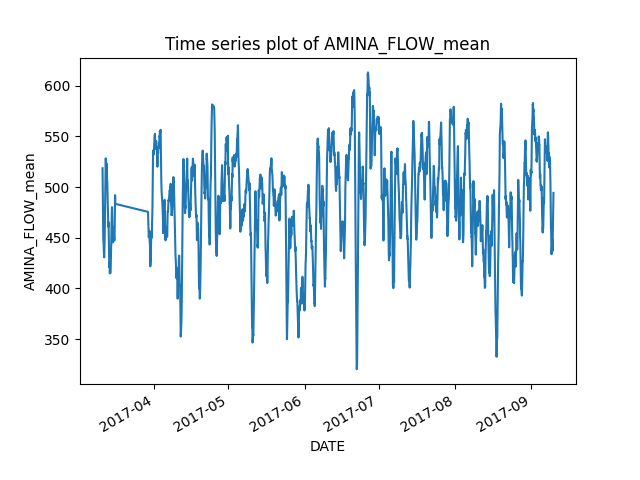
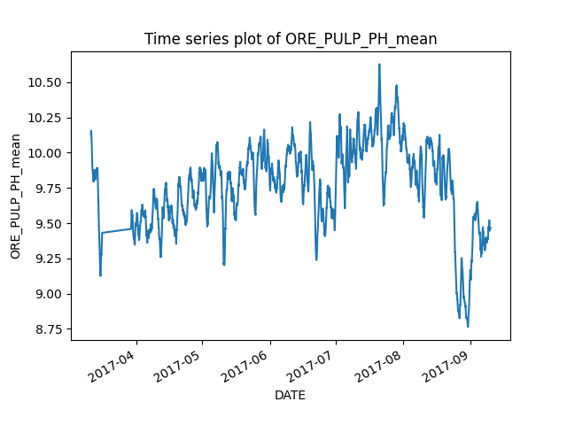

# Kaggle Mining Optimiser

[](LICENSE)
[](https://github.com/username/repo/releases)

This repository contains the code and configuration files for the Kaggle Mining Optimiser project. The project aims to optimize mining operations using machine learning models.

## Table of Contents

- [Introduction](#introduction)
- [Installation](#installation)
- [Configuration](#configuration)
- [Discussion](#discussion)
- [License](#license)

## Introduction

The Kaggle Mining Optimiser project uses machine learning models to predict and optimize the concentration of iron and silica in mining operations. The models are trained using historical data and various features related to the mining process.

## Installation

To install the required dependencies, run the following command:

```bash
pip install -r requirements.txt
```

## Configuration

You can configure the project by editing the following files in the `config` folder: `general.yaml`, `data.yaml`, `model.yaml`, `clustering.yaml`, `simulation.yaml`, and `optimisation.yaml`.

## Discussion

In this project we aim to build a simulation environment for a flotation unit in a mineral processing facility. Specially, we aim to optimize the iron and silica output concentrtions, given the feed inputs and flotation settings.

There are four stages to this project.

### 1. Data Preprocessing

In this stage, we clean and prepare the data for analysis. This includes handling missing values, interpolation, removing outliers, aggregating and feature engineering. Importantly, at each stage of the preprocessing, a series of artifacts are automatically produced: meta_data, time-series plots and histograms. This way there is a full understanding of the impact each stage has towards the final dataset. The preprocessing steps are as follows:

- **Initial Preprocessing**: Standardizes column names, cleans data by replacing commas with dots, converts specific columns to datetime and numeric types, and aggregates data by grouping it from half-secondly to hourly.
- **Missing Data Processing**: Identifies and corrects missing data by deleting rows with missing values, interpolating time series, and replacing missing values with specified values.
- **Outlier Processing**: Identifies and handles outliers using various methods such as IQR, Z-score, MAD, DBSCAN, Isolation Forest, and LOF.
- **Lag Introduction**: Introduces lags for specified features and automatically optimizes lags for the target feature.
- **Data Aggregation**: Performs rolling aggregation on the data. This ensures the data volume is lost, whilst the lag propagation times in the processing facility are effectively negligible.
- **Feature Engineering**: Creates new features that can improve model performance or can aid in the optimisation procedure.
- **Shutdown Filtering**: Filters out shutdown periods from the data.

These steps ensure that the data is cleaned, transformed, and ready for model training, evaluation, clusering, simulation and optimisation.

The following time-series trends describe some of the key features in our project:
|  |  |
|:-------------------------------------------------------------------------------------------------:|:--------------------------------------------------------------------------------------------------:|
|  |  |
|  |  |
|  |  |

### 2. Machine Learning Model Training

Here, we train two independent machine learning models using the preprocessed data. We experiment with different algorithms and hyperparameters to find the best-performing model for predicting both the concentration of iron and silica.

Importantly, monotonicity constraints are applied to ensure that the learned trends aren't overfitting and corresponding to expected on-site trends. This process is typically done in collaboration with domain experts and carefully considered. Furthermore, monotonicity is critical during the optimisation stage, to significantly prevent the degree of local minima that can occur. It also aids in the understanding of why the optimisation arrived to its set of optimal settings for the flotation cells.

The modeling steps are as follows:

- **Model Training**: The `ModelTrainer` class handles loading data, splitting data, training models, hyperparameter tuning, and evaluating models. Various machine learning algorithms such as Linear Regression, Decision Trees, Random Forests, and Gradient Boosting are considered. It also generates output files and visualizations based on the predictions.
- **Model Persistence**: The `ModelPersistence` class handles saving the trained models to disk and loading them for future use.
- **Model Inference**: The `ModelInference` class handles loading models and making predictions on new data, 

These steps ensure that the models are trained, evaluated, saved and ready for deployment in the mining optimization process.

Ultimately the Gradient Boosting algorithm was selected. This was due to four properties: It's out-of-the-box accuracy, it's speed, it's responsivenes to monotonicity constraints and because it's able to model non-linear interactions between features. This non-linear interaction modelling is critical during the optimisation stage, where we try to find the optimal set of flotation settings.

The iron concentration model and the silica concentration model produced R-squared values of 69% and 72% respectively. These are expressed visually in the following plots:

|  |  |
|:-------------------------------------------------------------------------------------------------:|:--------------------------------------------------------------------------------------------------:|

These model accuracies are good, but not impressive. However, in the context of optimisation, model accuracy is surprisingly unimportant. Consider the thought experiment of having only one feature in a system being modelled. The model accuracy may be very low, less than 10% for example. However, if we have a model that is able to perfectly model this one features impact on the system, then we can perfectly optimize this feature. Therefore, we aim to produce a model that can understand features and their interactions, more than a model that can more-accurately predict the target by partial-overfitting. As mentioned earlier, monotonicity is a key modelling step that bridges this gap and can turn a model that typically overfits, into a model that is well regularized, potentially underfitting and appopriate for optimisation.

### 3. Clustering

Here, the clustering and simulation steps take place. First, we create clusters for feed blends and controllable variables independently. This way we have an idea of the unique feed blends that pass through the flotation cells in the mineral processing facility. Then the controllable variables (air flow and level) in the flotation cell are clustered, so we have an idea of the unique set of settings that have historically been used to optimise the facilities outputs.

 The clustering steps are as follows:

- **Clustering Processor**: The `ClusteringProcessor` class handles loading data, selecting features, applying clustering algorithms, evaluating clusters, and generating artifacts. Various clustering algorithms such as K-Means, DBSCAN, and Agglomerative Clustering are used.
- **Evaluating Clusters**: The quality of the clusters is evaluated using metrics such as Silhouette Score, Davies-Bouldin Index, and Inertia.
- **Generating Artifacts**: Artifacts such as cluster labels and visualizations are generated to help understand the clustering results.

These steps ensure that the data is effectively clustered, providing valuable insights for further analysis and decision-making in the mining optimization process.

### 4. Simulation and Optimisation

In this final stage, we simulate different mining scenarios using the trained models and optimize the operations to achieve the best possible outcomes. First, we combine the feed blend and controllable clusters together, such that for each unique controllable cluster, it's paired with each each unique feed blend cluster. This can result in a very large set of combinations and we must be careful in how many clusters we are producing. Secondly, we pass these cluster combinations through each of the machine learning models to predict the iron and silic concentrates. Finally, for each unique feed blend, we examine the set of predictions for the iron and silica concentrate and identify which are considered optimal. In our case, we aim to maximise the iron concentration and minimize the silica concentration. To achieve this we engineer a feature that is the iron concentration multiplied by the inverse of the silica concentration, and aim to maximise this singular variable. Now we can identify the set of flotation air flow and level settings that are optimal for each feed blend that pass through the processing facility.

The simulation and optimization steps are as follows: The simulation and optimization steps are as follows:

- **Simulation Processor**: The `SimulationProcessor` class handles loading models and running simulations, by passing through cluster combinations through each machine learning model.
- **Optimization Processor**: The `OptimizationProcessor` class handles loading simulations, defining objectives, applying constraints and optimising.

These steps ensure that the mining operations are effectively simulated and optimized, providing valuable insights for improving efficiency and productivity in the mining process. These steps ensure that the mining operations are effectively simulated and optimized, providing valuable insights for improving efficiency and productivity in the mining process.

Our optimisation results suggest that we can on average increase the iron and concentration percentage by 0.3% and decrease the silica concentration percentage by -0.6%.

## License

This project is licensed under the Creative Commons Attribution-NonCommercial-NoDerivatives 4.0 International License. This license only allows for downloading and sharing of the work, as long as credit is made. It cannot be changed in any way or used commercially. See the LICENSE file for more details.

```plaintextplaintext
Creative Commons Attribution-NonCommercial-NoDerivs 4.0 International Public License

By exercising the Licensed Rights (defined below), You accept and agree to be bound by the terms and conditions of this Creative Commons Attribution-NonCommercial-NoDerivs 4.0 International Public License ("Public License"). To the extent this Public License may be interpreted as a contract, You are granted the Licensed Rights in consideration of Your acceptance of these terms and conditions, and the Licensor grants You such rights in consideration of benefits the Licensor receives from making the Licensed Material available under these terms and conditions.

...

For the full license text, please refer to https://creativecommons.org/licenses/by-nc-nd/4.0/legalcode