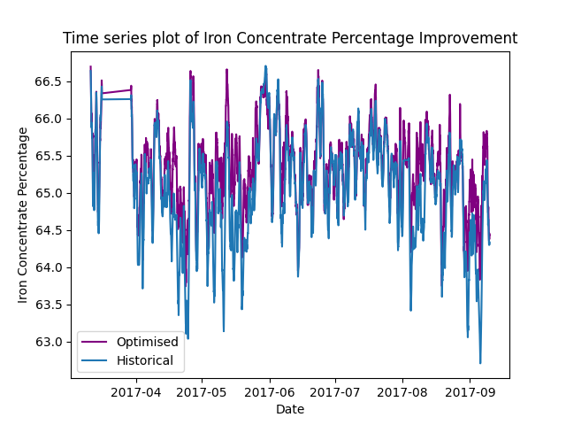

# Kaggle Mining Optimiser

[](LICENSE)
[](https://github.com/username/repo/releases)

This repository contains the code and configuration files for the Kaggle Mining Optimiser project. The project aims to optimize mining operations using machine learning models.

## Table of Contents

- [Introduction](#introduction)
- [Installation](#installation)
- [Configuration](#configuration)
- [Discussion](#discussion)
    - [1. Data Preprocessing](#1-data-preprocessing)
    - [2. Machine Learning Model Training](#2-machine-learning-model-training)
        - [Model Selection](#model-selection)
        - [Partial Dependence Plots](#partial-dependence-plots)
        - [Model Evaluation](#model-evaluation)
    - [3. Clustering](#3-clustering)
    - [4. Simulation and Optimisation](#4-simulation-and-optimisation)
- [License](#license)

## Introduction

The Kaggle Mining Optimiser addresses the critical challenge of maximizing mineral concentrate quality while ensuring process stability in mining operations. By leveraging machine learning, this project builds a simulation environment for a flotation unit, enabling the prediction and optimization of iron and silica concentrations based on feed inputs and flotation settings.

This project is structured into four key stages:

1.  **Data Preprocessing**: Comprehensive data cleaning and preparation, including handling missing values, outlier detection, feature engineering, and shutdown filtering, with automated artifact generation for transparency and understanding.
2.  **Machine Learning Model Training**: Development of predictive models for iron and silica concentrations, employing Gradient Boosting with monotonicity constraints to ensure realistic and optimization-friendly predictions.
3.  **Clustering**: Independent clustering of feed blends and controllable variables (air flow and level) to define distinct operational scenarios for simulation.
4.  **Simulation and Optimization**: Simulation of various operational scenarios using trained models, followed by optimization to determine the optimal flotation settings for each feed blend, aiming to maximize iron concentration and minimize silica concentration.

The project emphasizes not only achieving high predictive accuracy but also ensuring the models' interpretability and suitability for optimization through the application of monotonicity constraints. This approach facilitates a deeper understanding of the relationships between process parameters and mineral concentrate quality, leading to more effective and stable mining operations.


## Installation

To install the required dependencies, run the following command:

```bash
pip install -r requirements.txt
```

## Configuration

## Configuration

The project is configured via YAML files in the `config` directory:

- `general.yaml`: Project-wide settings (logging, output paths).
- `data.yaml`: Data loading and preprocessing parameters.
- `model.yaml`: Machine learning model configuration (algorithms, hyperparameters).
- `clustering.yaml`: Clustering settings (algorithms, parameters).
- `simulation.yaml`: Simulation scenario definitions.
- `optimisation.yaml`: Optimization objectives and constraints.

Each file allows customization of its respective pipeline stage.

## Discussion

In this project we aim to build a simulation environment for a flotation unit in a mineral processing facility. Specially, we aim to optimize the iron and silica output concentrtions, given the feed inputs and flotation settings.

There are four stages to this project.

### 1. Data Preprocessing

This stage ensures the data's quality and suitability for subsequent modeling and optimization. It encompasses a series of transformations designed to clean, enrich, and prepare the raw data:

- **Initial Cleanup and Aggregation**:
    - Standardizes column names and data formats.
    - Converts data types and aggregates high-frequency data (e.g., half-secondly) to hourly intervals, reducing noise and computational load.
- **Missing Data Management**:
    - Identifies and addresses missing values through strategic deletion, interpolation (for time-series data), or replacement with appropriate values.
- **Outlier Detection and Handling**:
    - Employs various statistical and machine learning techniques (IQR, Z-score, DBSCAN, Isolation Forest) to identify and mitigate the impact of outliers.
- **Lag Feature Engineering**:
    - Introduces time-lagged features to capture temporal dependencies, particularly optimizing lags for the target variables (iron and silica concentrations).
- **Rolling Aggregation**:
    - Further reduces data volume while preserving essential temporal patterns and mitigating the effects of lag propagation delays within the processing facility.
- **Advanced Feature Engineering**:
    - Creates new features that enhance model performance and provide valuable insights for optimization.
- **Shutdown Period Filtering**:
    - Removes data segments corresponding to facility shutdown periods, ensuring that the models are trained on representative operational data.

Throughout this stage, a set of artifacts—including metadata, time-series plots, and histograms—are generated to provide transparency and understanding of the data transformation process.

The following trends are of key features in our project:
|  |  |
|:-------------------------------------------------------------------------------------------------:|:--------------------------------------------------------------------------------------------------:|
|  |  |
|  |  |

### 2. Machine Learning Model Training

We train two independent machine learning models using the preprocessed data. We experimented with different algorithms and hyperparameters to find the best-performing model for predicting both the concentration of iron and silica. Importantly, monotonicity constraints are applied to ensure that the learned trends are not overfitting and correspond to expected on-site trends. This process is typically done in collaboration with domain experts and carefully considered. Furthermore, monotonicity is critical during the optimisation stage, to significantly prevent the degree of local minima that can occur. It also aids in the understanding of why the later optimisation arrived at its set of optimal settings for the flotation cells.

The modeling steps / classes are as follows:

- **Model Training**: The `ModelTrainer` class handles loading data, splitting data, training models, hyperparameter tuning, and evaluating models. Various machine learning algorithms such as Linear Regression, Decision Trees, Random Forests, and Gradient Boosting are considered. It also generates output files and visualizations based on the predictions.
- **Model Persistence**: The `ModelPersistence` class handles saving the trained models to disk and loading them for future use.
- **Model Inference**: The `ModelInference` class handles loading models and making predictions on new data.

These steps ensure that the models are trained, evaluated, saved, and ready for deployment in the mining optimization process.

#### Model Selection

Ultimately, the Gradient Boosting algorithm was selected. This was because of four properties: its out-of-the-box accuracy, its speed, its responsiveness to monotonicity constraints, and its ability to model non-linear interactions between features. This non-linear interaction modeling is critical during the optimisation stage, where we try to find the optimal set of flotation settings.

#### Partial Dependence Plots

PDPs are created by simulating the model's predictions over a range of values for the feature(s) of interest, while keeping all other features constant. This allows us to visualize how changes in the feature(s) impact the model's predictions. PDPs are particularly useful for interpreting complex models like Gradient Boosting, as they provide insights into the model's behavior and feature interactions.

To determine if monotonicity needs to be applied, we can examine the PDPs for any unexpected or non-intuitive trends. For example, if the PDP shows that increasing a feature value leads to a decrease in the predicted outcome, contrary to domain knowledge, it indicates that monotonicity constraints might be necessary.

In this project, PDPs are used to verify that the monotonicity constraints are effectively capturing the expected trends and to ensure that the model's predictions are realistic and suitable for optimization.

Here's an example of some of the most important drivers in the iron concentration model, before and after monotonicity was applied:

|  |  |
|:-------------------------------------------------------------------------------------------------:|:--------------------------------------------------------------------------------------------------:|
|  |  |

#### Model Evaluation

The iron concentration model and the silica concentration model produced R-squared values of 69% and 72% respectively. These are expressed visually in the following plots:

|  |  |
|:-------------------------------------------------------------------------------------------------:|:--------------------------------------------------------------------------------------------------:|

These model accuracies are good, but not impressive. However, in the context of optimization, model accuracy is surprisingly unimportant. Consider the thought experiment of having only one feature in a system being modeled. The model accuracy may be very low, less than 10% for example. However, if we have a model that is able to perfectly model this one feature's impact on the system, then we can perfectly optimize this feature. Therefore, we aim to produce a model that can understand features and their interactions, more than a model that can accurately predict the target by partial-overfitting. As mentioned earlier, monotonicity is a key modeling step that bridges this gap and can turn a model that typically overfits, into a model that is well regularized, potentially underfitting, and appropriate for optimization.

### 3. Clustering

In this stage, the clustering and simulation steps take place. First, we create clusters for feed blends and controllable variables independently. This way we have an idea of the unique feed blends that pass through the flotation cells in the mineral processing facility. Then the controllable variables (air flow and level) in the flotation cell are clustered, so we have an idea of the unique set of settings that have historically been used to optimise the facilities outputs.

 The clustering steps /classes are as follows:

- **Clustering Processor**: The `ClusteringProcessor` class handles loading data, selecting features, applying clustering algorithms, evaluating clusters, and generating artifacts. Various clustering algorithms such as K-Means, DBSCAN, and Agglomerative Clustering are used.
- **Evaluating Clusters**: The quality of the clusters is evaluated using metrics such as Silhouette Score, Davies-Bouldin Index, and Inertia.
- **Generating Artifacts**: Artifacts such as cluster labels and visualizations are generated to help understand the clustering results.

These steps ensure that the data is effectively clustered, providing valuable insights for further analysis and decision-making in the mining optimization process.

### 4. Simulation and Optimisation

In this final stage, we simulate different mining scenarios using the trained models and optimize the operations to achieve the best possible outcomes. First, we combine the feed blend and controllable clusters together, such that for each unique controllable cluster, it's paired with each each unique feed blend cluster. This can result in a very large set of combinations and we must be careful in how many clusters we are producing as their multiplication may be significant. Secondly, we pass these cluster combinations through each of the machine learning models to predict the iron and silic concentrates. Finally, for each unique feed blend, we examine the set of predictions for the iron and silica concentrate and identify which are considered optimal. In our case, we aim to maximise the iron concentration and minimize the silica concentration. To achieve this we engineer a feature that is the iron concentration multiplied by the inverse of the silica concentration, and aim to maximise this singular variable. Now we can identify the set of flotation air flow and level settings that are optimal for each feed blend that pass through the processing facility.

The simulation and optimization steps /classes are as follows: The simulation and optimization steps are as follows:

- **Simulation Processor**: The `SimulationProcessor` class handles loading models and running simulations, by passing through cluster combinations through each machine learning model.
- **Optimization Processor**: The `OptimizationProcessor` class handles loading simulations, defining objectives, applying constraints and optimising.

These steps ensure that the mining operations are effectively simulated and optimized, providing valuable insights for improving efficiency and productivity in the mining process.

Overlaying the historical and optimised iron and silica concentration percentage trends. We can see, on average, there's an improved iron concentration and silica concentration. We can see this in the following trends:

|  |  |
|:-------------------------------------------------------------------------------------------------:|:--------------------------------------------------------------------------------------------------:|

## License

This project is licensed under the Creative Commons Attribution-NonCommercial-NoDerivatives 4.0 International License. This license only allows for downloading and sharing of the work, as long as credit is made. It cannot be changed in any way or used commercially. See the LICENSE file for more details.

```plaintextplaintext
Creative Commons Attribution-NonCommercial-NoDerivs 4.0 International Public License

By exercising the Licensed Rights (defined below), You accept and agree to be bound by the terms and conditions of this Creative Commons Attribution-NonCommercial-NoDerivs 4.0 International Public License ("Public License"). To the extent this Public License may be interpreted as a contract, You are granted the Licensed Rights in consideration of Your acceptance of these terms and conditions, and the Licensor grants You such rights in consideration of benefits the Licensor receives from making the Licensed Material available under these terms and conditions.

For the full license text, please refer to https://creativecommons.org/licenses/by-nc-nd/4.0/legalcode